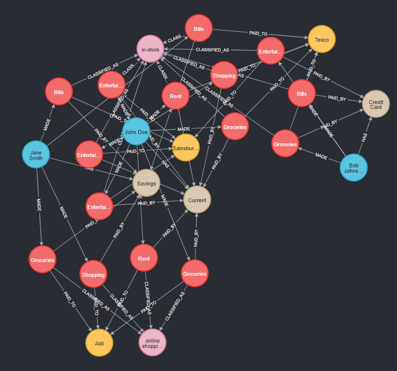

# Generating Cypher with an LLM

This program will generate cypher queries and call them on a database that has been populated with dummy data. The cypher queries are generated using Mistral Large as its large language model.

## Set Up

- To install all project dependencies (listed in requirements.txt) run `pip install -r requirements.txt`.
- Obtain a Mistral API key from [here](https://mistral.ai/)

## Neo4j Database Set Up

You will need to use Neo4j Desktop, this can be downloaded [here](https://neo4j.com/download/)

Once installed follow the steps below:

1. Create new project to host your DBMS.
2. Create a new database within the project.
3. Add the username and password to the `.env` file.
4. Add the database uri to the `.env` file. The default value for this is `bolt://localhost:7687`
5. Run the database in Neo4j desktop.

### Populate Dummy Data

In order for the application to be run, it must be loaded with the dummy data in `dummy_data.txt`.

Follow these steps:
1. Open the database in Neo4j desktop with Neo4j Browser.
2. Copy the contents of `dummy_data.txt` and paste into Neo4j Browser.
3. Confirm that nodes are created by running `MATCH (n) RETURN n`.

The graph that is populated should look like:

## Run the Program
To run the program, confirm that all set up tasks are completed and then run
`python generate_cypher.py`.

An example question has been added: `What did I spend more on Sainsburys or Tesco?`.

This should return something similar to: `John, you spent more at Tesco, with a total of £1750. In contrast, your total spending at Sainsburys was £45.`

Please try out different questions to query the database in different ways. There are more example questions below.

## Example Questions
- What is the capital of France?
- What transactions were made today?
- How many transactions were made in  January 2024?
- Who did I spend the most money with?
- Calculate the total amount Jane Smith spent in each transaction category.
- What was the latest transaction I made to Sainsburys?
- Find all persons who made transactions with Aldi?
- How much have I spent on rent?
